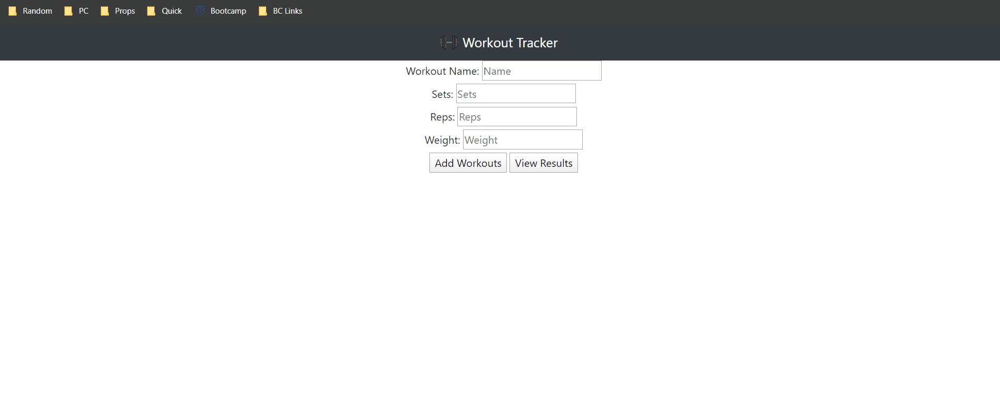

# Budget-Tracker

## Description
The user will be able to add expenses and deposits to their budget with or without a connection. When entering transactions offline, they should populate the total when brought back online.

## Table of Contents
* [Installation](#installation)
* [Demo](#demo)
* [Credits](#credits)

## Installation
In your terminal type: 
```git clone https://github.com/verlitas/Budget-Tracker.git```
* Open in Visual Studio to build and run.
* For further instructions, visit https://help.github.com

## Demo

Live Link: https://frozen-headland-55130.herokuapp.com/

## Credits
[UABootCamp](https://bootcamp.ce.arizona.edu/coding/)  